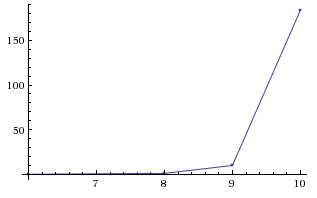
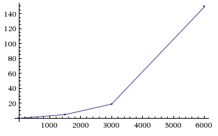

# Traveling Salesman Problem

Two implementations of solutions to the Traveling Salesman Problem in Python 3.

The first solution brute forces all permutations and is guaranteed to find
the optimal solution for visiting all points.

The second solution is "nearest neighbor", which is much faster, but is not
guaranteed to find the optimal solution. In some edge cases, it finds very poor
solutions.

My implementations of these algorithms display about O(n!) and 1/4 O(n^2) time,
respectively.

## Usage

If you want to run the comparisons yourself, just go

    ./run.sh

Or, if you want to run individual tests, just use `./optimaltsp.py FILENAME` or
`./nearestneighbor.py FILENAME`.

## Graphs

Here are some quick runtime graphs, courtesy of [WolframAlpha](http://www.wolframalpha.com).

### Optimal

### Nearest neighbor

## Data

